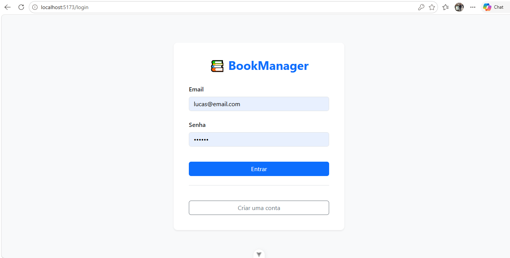
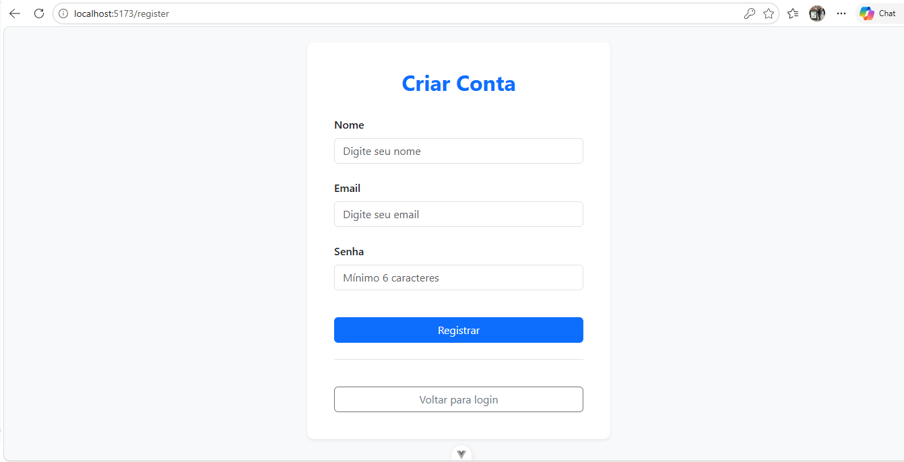
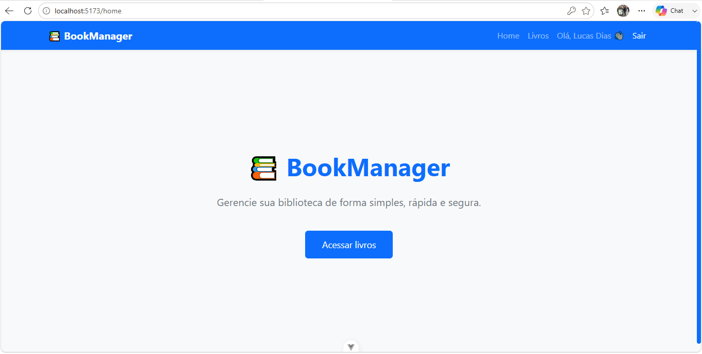
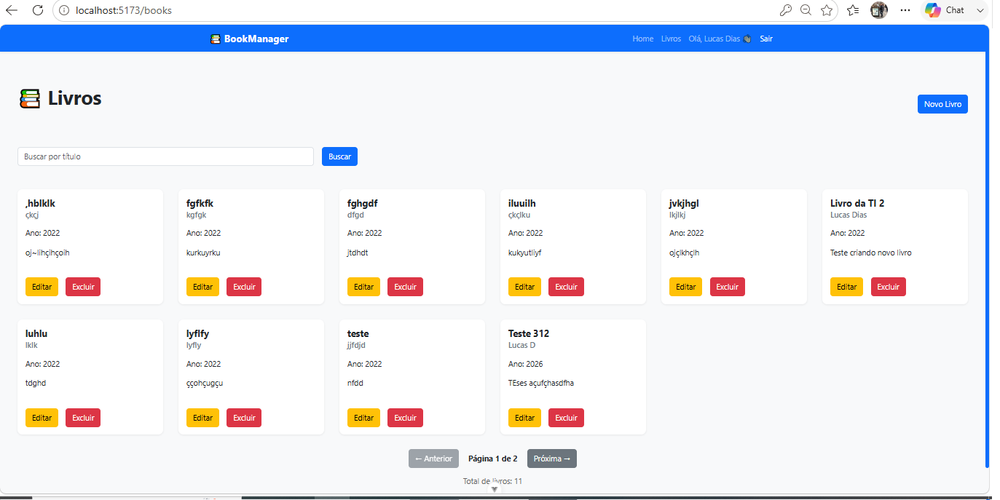
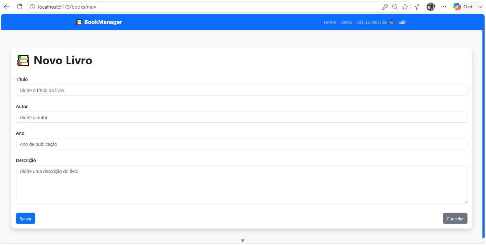
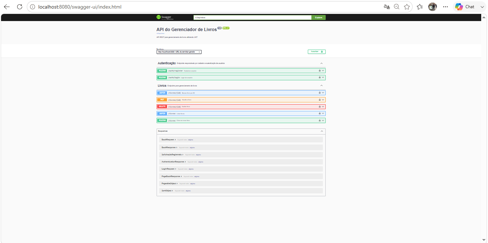

# 📚 Book Manager

Aplicação Full-Stack para gerenciamento de livros desenvolvida como desafio técnico.

## Funcionalidades

- Cadastro de usuários
- Login com JWT
- CRUD completo de livros
- Busca por título
- Paginação
- Proteção de rotas
- Swagger/OpenAPI
- Docker e Docker Compose

## Tecnologias

### Backend
- Java 21
- Spring Boot
- Spring Security
- JWT
- Spring Data JPA
- PostgreSQL
- Maven

### Frontend
- Vue 3
- TypeScript
- Vite
- Vue Router
- Pinia
- Axios
- Bootstrap 5


## Infraestrutura

- Docker
- Docker Compose
- Nginx
- PostgreSQL Containerizado


---

# ✨ Funcionalidades implementadas

## 🔐 Autenticação e segurança

- Cadastro de usuários
- Login utilizando JWT
- Geração de token autenticado pelo backend
- Armazenamento do token no frontend
- Proteção das rotas privadas
- Controle de sessão através do JWT
- Logout manual
- Logout automático após expiração do token


## 📚 Gerenciamento de livros

- Cadastro de livros
- Listagem paginada
- Busca por título
- Consulta por ID
- Atualização de livros
- Exclusão de livros
- Associação dos livros ao usuário autenticado


## ✅ Validações

### Frontend

- Validação de campos obrigatórios
- Controle de formulário
- Mensagens de retorno amigáveis
- Tratamento de erros da API
- Controle de carregamento durante requisições


### Backend

- Validação dos dados recebidos
- Controle de autenticação
- Proteção dos endpoints
- Tratamento global de exceções


---

# 🔒 Segurança JWT

A aplicação utiliza autenticação baseada em **JSON Web Token (JWT)**.

O fluxo de autenticação funciona da seguinte forma:


Usuário
|
v
Realiza login
|
v
Backend valida credenciais

Autorização: Token de Portador


## Implementações de segurança:

- Token Stateless
- Expiração configurável
- Secret configurado através de variável de ambiente
- Token contendo apenas informações necessárias
- Subject utilizando o ID do usuário
- Nome do usuário armazenado como claim
- Senhas protegidas utilizando BCrypt
- Filtro JWT utilizando Spring Security
- Interceptor Axios para envio automático do token
- Remoção automática do token inválido no frontend


---

# 🏗️ Arquitetura da aplicação

O projeto foi desenvolvido utilizando separação de responsabilidades.

A arquitetura segue o padrão de camadas, mantendo baixo acoplamento entre as responsabilidades da aplicação.


🎨 Frontend

O frontend foi desenvolvido utilizando Vue 3, TypeScript e Vite, adotando uma arquitetura baseada em componentes para promover reutilização de código, organização e facilidade de manutenção.

A aplicação é responsável pela interação com o usuário, consumo da API REST do backend e gerenciamento do estado da autenticação.

Responsabilidades das camadas
Opiniões

Responsáveis pelas páginas da aplicação.

Cada View representa uma rota acessível pelo usuário e é composta por diversos componentes reutilizáveis.

Visualizações implementadas:

LoginView
RegisterView
HomeView
BooksView
BookFormView
NotFoundView

Responsabilidades:

Exibir informações ao usuário
Organizar os componentes da página
Acionar Services quando necessário
Controlar estados de carregamento
Componentes

Residência

Os componentes encapsulam partes reutilizáveis da aplicação, evitando repetição de código.

Exemplos:

Navbar
Nota lateral
BookCard
BookForm
SearchBar
Paginação
Rotação de Carga
ConfirmDiálogo

Responsabilidades:

Exibir elementos da interface
Receber propriedades (Props)
Emitir eventos (Emits)
Reutilização entre páginas
Roteador

Responsável pelo gerenciamento das rotas da aplicação.

Utilizando Vue Router, o sistema controla a navegação entre páginas públicas e privadas.

Principais responsabilidades:

Navegação SPA (Aplicação de Página Única)
Proteção de rotas autenticadas
Redirecionamento para Login
Tratamento de rotas inexistentes (404)

Exemplo de rotas:

/

login

register

books

books/new

books/:id/edit
Lojas (Pinia)

Responsáveis pelo gerenciamento global de estados da aplicação.

A Store centraliza informações compartilhadas entre diversos componentes.

Exemplo:

AuthStore

Responsável por:

Armazenar o JWT
Controlar usuário autenticado
Logar
Desconectar
Persistência da sessão
Serviços

Responsáveis pela comunicação com o backend.

Cada Service encapsula as chamadas HTTP utilizando Axios.

Services implementados:

AuthService

Responsável por:

Cadastro
Logar
Desconectar
BookService

Responsável por:

Listagem
Busca
Cadastro
Atualização
Exclusão de livros

Benefícios:

Centralização das chamadas HTTP
Reutilização de código
Facilidade para manutenção
Axios

A comunicação entre frontend e backend é realizada através do Axios.

Foi configurada uma instância personalizada contendo:

URL base da API
Tempo
Headers padrão
Interceptor de autenticação

O interceptor adiciona automaticamente o token JWT em todas as requisições autenticadas.

Authorization: Bearer <JWT_TOKEN>

Além disso, respostas com erro 401 Unauthorized removem automaticamente o token inválido e redirecionam o usuário para a tela de login.

Gerenciamento da autenticação

O frontend controla toda a autenticação da aplicação através do JWT.

Fluxo:

Usuário

↓

Login

↓

Backend

↓

JWT

↓

Pinia

↓

LocalStorage

↓

Interceptor Axios

↓

Requisições autenticadas
Estrutura do projeto
frontend/
│
├── public/
│
├── src/
│   ├── assets/
│   ├── components/
│   ├── views/
│   ├── router/
│   ├── stores/
│   ├── services/
│   ├── types/
│   ├── interfaces/
│   ├── layouts/
│   ├── App.vue
│   └── main.ts
│
├── .env
├── vite.config.ts
├── package.json
└── tsconfig.json
Fluxo da aplicação
Usuário

↓

View

↓

Component

↓

Service

↓

Axios

↓

Backend REST API

↓

Resposta

↓

Atualização da Interface
---

# Backend


# Responsabilidades das camadas


## Controller

Responsável por:

- Receber requisições HTTP
- Validar entradas
- Mapear DTOs
- Retornar respostas HTTP adequadas
- Encaminhar regras de negócio para os Services


Controllers implementados:


### AuthController

Responsável por:

- Cadastro de usuários
- Autenticação
- Geração do token JWT


Endpoints:


POST /auth/register

POST /auth/login


### BookController

Responsável pelo gerenciamento dos livros:

- Criar livros
- Listar livros
- Buscar livros
- Atualizar livros
- Excluir livros


Endpoints:


GET /books

POST /livros

GET /books/{id}

PUT /books/{id}

DELETE /books/{id}


---


## Service

Responsável por:

- Regras de negócio
- Validação das operações
- Comunicação entre Controller e Repository
- Controle de acesso aos dados


Serviços implementados:


### AuthService

Responsável por:

- Cadastro de usuários
- Criptografia das senhas
- Autenticação
- Geração de JWT


### BookService

Responsável por:

- Cadastro de livros
- Consulta de livros
- Atualização
- Exclusão
- Associação entre usuário autenticado e livros


---


## Repository

Responsável por:

- Comunicação com banco de dados
- Operações utilizando Spring Data JPA
- Consultas utilizando Hibernate


Repositories implementados:


### UserRepository

Responsável pelo acesso aos usuários.


### BookRepository

Responsável pelo acesso aos livros.


---


## DTO

A aplicação utiliza DTOs para separar as entidades internas dos dados expostos pela API.


Benefícios:

- Maior segurança dos dados
- Controle das informações enviadas e recebidas
- Evita exposição direta das entidades JPA
- Facilita evolução da API


DTOs implementados:


### Request


Responsáveis pelos dados recebidos pela API:


SolicitaçãoRegistrado

LoginRequest

BookRequest


### Response


Responsáveis pelos dados retornados:


AuthenticationResponse

BookResponse


---


# 🔐 Configuração de Segurança

A segurança da aplicação foi implementada utilizando:


- Spring Security
- JWT Authentication Filter
- UserDetailsService personalizado
- BCrypt Password Encoder


Fluxo:


Solicitar HTTP

 |

Filtro de Autenticação JWT

 |

Validação do Token

 |

SecurityContext

 |

Controlador protegido


A classe:


JwtAuthenticationFilter


é responsável por interceptar as requisições e validar o token enviado no Header:


Autorização: Token de Portador


---

# ⚠️ Tratamento de exceções

A aplicação possui tratamento global de erros utilizando:


GlobalExceptionHandler


Responsável por:

- Centralizar respostas de erro
- Padronizar mensagens da API
- Evitar repetição de código nos Controllers


Exceções personalizadas:


## ResourceNotFoundException

Utilizada quando um recurso solicitado não é encontrado.


Exemplo:


Livro informado não encontrado.


## DuplicateResourceException

Utilizada quando ocorre tentativa de cadastro duplicado.


Exemplo:


E-mail já cadastrado.


---

# 📖 Documentação da API


A API possui documentação utilizando:


Swagger / OpenAPI


Configuração realizada através:


OpenApiConfig


Recursos disponíveis:


- Visualização dos endpoints
- Descrição dos métodos HTTP
- Testes diretamente pelo navegador
- Autenticação utilizando JWT Bearer Token


Swagger disponível:


http://localhost:8080/swagger-ui/index.html


---

# 🧪 Testes automatizados


O backend possui testes utilizando:


Mockito do Teste
de Bota de Mola da JUnit


Os testes estão organizados:


src/test/java/com/bookmanager/backend

├── controllerTeste

├── serviceTeste

└── BackendApplicationTests


Testes implementados:


## BookControllerTest

Valida:

- Requisições HTTP dos livros
- Respostas dos endpoints
- Fluxo dos controllers


## BookServiceTest

Valida:

- Regras de negócio
- Operações CRUD
- Tratamentos de exceções


## AuthServiceTest

Valida:

- Cadastro de usuários
- Autenticação
- Geração de token


---

# 🐳 Containerização


O backend possui configuração própria utilizando Docker.


Arquivo:


Dockerfile


Responsável por:

- Criar imagem da aplicação Spring Boot
- Instalar dependências
- Executar aplicação em ambiente isolado


Arquivos relacionados:


.dockerignore

Dockerfile

docker-compose.yml


Benefícios:


- Ambiente padronizado
- Facilidade de execução
- Isolamento de dependências
- Integração com PostgreSQL containerizado


---

---

# 📂 Estrutura do projeto


---

## Tela de Login

Descrição:

> Tela inicial da aplicação exibindo o formulário de autenticação com campos de e-mail e senha, botão de login e opção para cadastro de novo usuário.





Tela de Cadastro

Descrição:

Tela de criação de usuário contendo nome, e-mail, senha e botão de cadastro.





Tela Home

Descrição:

Tela principal após autenticação mostrando a navegação da aplicação, acesso ao gerenciamento de livros e usuário autenticado.

Inserir:



---

## Tela de Gerenciamento de Livros

Descrição:

Tela responsável pelo gerenciamento da biblioteca pessoal do usuário autenticado.

Funcionalidades apresentadas:

- Visualização dos livros cadastrados
- Busca por título
- Acesso à edição
- Exclusão de livros
- Botão para cadastro de novos livros





---

## Tela de Cadastro de Livro

Descrição:

Formulário utilizado para adicionar um novo livro à biblioteca do usuário.

Campos disponíveis:

- Título
- Autor
- Ano de publicação
- Descrição


Cadastro de livro:




---

## Documentação Swagger / OpenAPI

Descrição:

A API disponibiliza documentação interativa utilizando Swagger/OpenAPI.

Através desta interface é possível:

- Visualizar endpoints disponíveis
- Testar requisições HTTP
- Validar respostas da API
- Testar autenticação JWT utilizando Bearer Token


Inserir:




---

# 🗄️ Banco de dados

O projeto utiliza PostgreSQL como banco de dados principal.

Banco utilizado:


Bookmanager

## 🗄️ Criação do banco de dados

Antes de executar a aplicação, crie apenas o banco de dados:

```sql
CREATE DATABASE bookmanager;
```

Não é necessário criar as tabelas manualmente.

Na inicialização da aplicação, o Spring Boot executará automaticamente o arquivo `schema.sql` localizado em:

```
book-manager/
├── backend/
├── frontend/
├── docker-compose.yml
└── README.md
```

## Pré-requisitos

- Java 21
- Node.js 22+
- Maven
- Docker e Docker Compose (recomendado)

## Configuração

Copie os arquivos de exemplo:

Backend

```
cp backend/.env.example backend/.env
```

Frontend

```
cp frontend/.env.example frontend/.env
```

No Windows, basta renomear `.env.example` para `.env`.

## Executando com Docker

```
docker compose up --build
```

A aplicação ficará disponível em:

- Frontend: http://localhost:5173
- Backend: http://localhost:8080
- Swagger: http://localhost:8080/swagger-ui/index.html

O banco PostgreSQL é criado automaticamente pelo Docker através da variável `POSTGRES_DB`, não sendo necessário executar `CREATE DATABASE`.

## Execução Local

Backend:

```
cd backend
mvn clean install
mvn spring-boot:run
```

Frontend:

```
cd frontend
npm install
npm run dev
```

## Endpoints

### Autenticação

- POST /auth/register
- POST /auth/login

### Livros

- GET /books
- GET /books/{id}
- POST /books
- PUT /books/{id}
- DELETE /books/{id}

## Testes

O backend possui testes automatizados para:

- AuthService
- BookService
- BookController

## Telas

- Login

- Cadastro

- Home

- Lista de Livros

- Cadastro/Edição de Livro

- Swagger


## Melhorias futuras

- Refresh Token
- Recuperação de senha
- Upload de capa
- Testes de frontend
- CI/CD
- Deploy em nuvem

## Autor

**Lucas Dias**

GitHub: https://github.com/Kurt1308

Repositório:

https://github.com/Kurt1308/book-manager-full-stack-defafio.git
